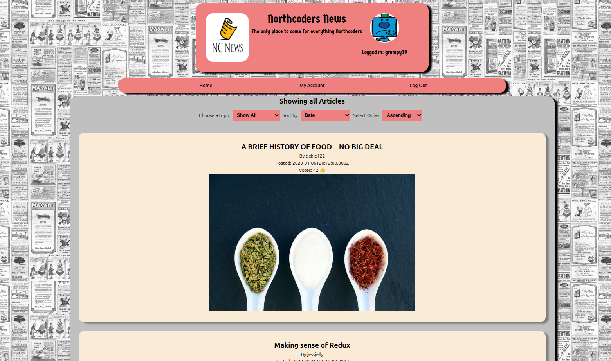

# NC News Front End Project

This is a front end UI for the PSQL database hosted during the creation of the NC (Northcoders) News back end project, which was hosted on Render https://nc-news-backend-boh2.onrender.com.

To access the front End UI for this. Access the following link: 
https://newsatnorthcoders.netlify.app

Minimum requirements:
Node.js version 23.9.0 or greater should be installed for this app's full functionality.

# Usage

Log in and out of the is hardcoded at this moment, though I will look to add authentication at a later date.
A user is presented with list of available articles on the first screen. Clicking on an article will load that article and give extra functionality in the form of adding or deleting a comment or liking the current article. Articles displayed on the main screen can be ordered by comment count, date and likes. The user can also narrow the search down to articles on a selected topic using the drop down in the main nav bar.

If you wish to run this project locally, clone the repo using the below command:
```terminal
# clone the repository
:$ git clone https://github.com/TestMango-sudo/nc-news-fe.git

# change directory
:$ cd nc-news-fe

# install dependencies
:$ npm install

# run NC News
:$ npm run dev
```

The main screen you should see on running is this one. Most the available UI is visible from this screen.


# Other Information
This portfolio project was created as part of a Digital Skills Bootcamp in Software Engineering provided by [Northcoders](https://northcoders.com/)